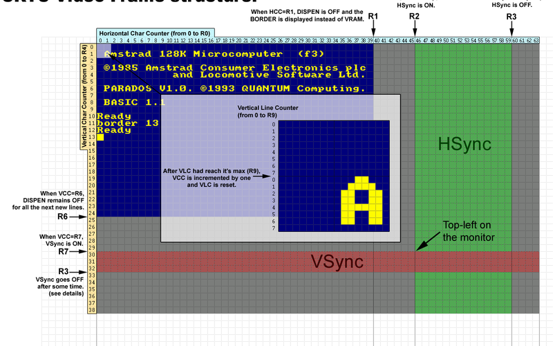

# CRTC Internal Counters & State Machine

The CRTC is, at its core, a collection of **counters** and **comparators**. Every
video behavior — HSYNC, VSYNC, BORDER, display enable, memory addressing, and
frame parity — is the product of a handful of internal counters being compared
against programmable registers at specific microsecond boundaries.

This page documents the internal counter architecture and the precise counting
rules that differ between CRTC Types 0–4. This is the *missing piece* required
for cycle-accurate emulation of splits, ruptures, overscan, and interlace.



---

## Counter & State Glossary

Emulator authors are strongly encouraged to adopt these names.

| Symbol | Alias (other emulators) | Width | Role |
|--------|------------------------|-------|------|
| `C0`   | HCC (Horizontal Char Counter) | 8-bit | Counts characters within a scanline (0..R0). |
| `C9`   | VLC (Vertical Line Counter)   | 5-bit | Counts scanlines within a character row (0..R9). |
| `C4`   | VCC (Vertical Char Counter)   | 7-bit | Counts character rows within a frame (0..R4, can exceed). |
| `C5`   | VTAC (Vert. Total Adjust Counter) | 5-bit | Vertical adjust line counter. **Only exists on Type 1 & 2.** Type 0/3/4 reuse `C9`. |
| `C3l`  | HSC (Horizontal Sync Counter) | 4-bit | Counts µs inside an HSYNC pulse. |
| `C3h`  | VSC (Vertical Sync Counter)   | 4-bit | Counts lines inside a VSYNC pulse. |
| `VMA`  | — (active video pointer)      | 14-bit | The address actually output to the Gate Array each µs. |
| `VMA'` | — (line-start pointer)        | 14-bit | Snapshot of `VMA` at `C0=R1 ∧ C9=R9`; reloaded into `VMA` at `C0=0`. |

### Internal States (flip-flops, not counters)

These are single-bit latches inside the CRTC. They are the source of most
type-specific behavioral differences:

| State | Meaning | Exists on |
|-------|---------|-----------|
| `LastLine` | Armed when `C4==R4 ∧ C9==R9` is evaluated true. Forces `C4←0, C9←0` next line. | 0, 2 (conceptually 1/3/4 evaluate per-line) |
| `LastLineMgmt` | Permits re-evaluation of `LastLine` mid-line on R4/R9 writes (outside HSYNC). | 2 |
| `LastPrevLine` | Snapshot of `LastLine` at end of HSYNC. Used to suppress double-last-line. | 2 |
| `AdjMgmt` (Additional Mgmt) | Active during R5 vertical-adjust lines. Changes C4/C9 counting rules. | All |
| `C9Mgmt` | Permits C9 increment on next `C0=R0`. Inhibited when `R0<2` on Type 0. | 0 |
| `VSYNC_GA` | Gate Array's own VSYNC handling flag (set when CRTC VSYNC rising edge seen). | GA/ASIC side |
| `ParityFrame` | Frame parity for interlace (even/odd). Toggles each frame start. | All (IVM) |
| `ParityC9` | Bit-0 parity used in IVM counting. | 0, 3, 4 |
| `ParityR6` | Anticipated parity for *next* frame, latched when `C4==R6`. | 0, 2 |
| `RFD_VMA_From_R12R13` | When true, `VMA ← R12/R13` at `C0=0` regardless of `C4`. (Rupture for Dummies) | 1 |

---

## The Ideal Counting Algorithm

Real silicon deviates per-type as documented in later sections.

```text
Every 1 µs (CRTC character clock):

  C0 ← C0 + 1
  if C0 == R0:
      C0 ← 0
      C9 ← C9 + 1
      if C9 == R9:
          C9 ← 0
          C4 ← C4 + 1
          if C4 == R4:
              if C5 == R5:        # or C9==R5 on Type 0/3/4
                  C4 ← 0
                  C5 ← 0
                  VMA' ← R12/R13  # frame start reload
              else:
                  C5 ← C5 + 1

  # Synchronizations
  if C0 == R2:  HSYNC starts, C3l ← 0
  if HSYNC active:
      C3l ← C3l + 1
      if C3l == R3l:  HSYNC ends

  if C4 == R7:  VSYNC starts, C3h ← 0
  if VSYNC active:
      C3h ← C3h + 1
      if C3h == R3h (or 16):  VSYNC ends

  # Display enable
  if C0 == 0:    DISPEN ← ON   (unless BORDER R6 active)
  if C0 == R1:   DISPEN ← OFF
  if C4 == 0:    DISPEN(row) ← ON
  if C4 == R6:   DISPEN(row) ← OFF

  # Video pointer
  VMA ← VMA + 2   (each µs, while DISPEN active)
  if C0 == R1 ∧ C9 == R9:  VMA' ← VMA
  if C0 == 0:              VMA  ← VMA'  (or R12/R13 if C4==C9==0 on Type 0/3/4)
```

**Critical**: the above is *idealized*. Each CRTC type deviates in ways that
matter for emulation. The deviations are documented below per-counter.

---

## C0 — Horizontal Character Counter

| Property | Value |
|----------|-------|
| Width | 8-bit |
| Clock | +1 each µs |
| Reset condition | `C0 == R0` → `C0 ← 0` |
| Compared against | R0 (reset), R1 (DISPEN off), R2 (HSYNC start) |

### Type 0 special-case: `R0 < 2`

Type 0 performs internal housekeeping on `C0 = 0, 1, 2`:

- **`C0 = 0`**: Counter updates (C4, C9) are applied based on states armed on
  the previous line. Then states for *next* line are evaluated. If `C9 == R9`,
  C4 increment is armed. This armament may be cancelled at `C0 = 2`.
- **`C0 = 1`**: C9-management is re-authorized for the next `C0 = R0`. If `R0`
  was set to 0 on `C0 = 0`, C9 is updated one last time using the old R9 (if
  previous `R0 > 1`), then frozen. `LastLine` state is re-evaluated.
- **`C0 = 2`**: On a `LastLine`, additional-management (R5) is confirmed or
  cancelled based on `R5 > 0` and interlace-line conditions.

Consequences for Type 0:

- **`R0 = 0`**: `C0` never reaches 1. `C9` is frozen at its pre-`R0=0` value.
  - If `C9 == R9` on the first `C0=0`, C4 increments **once** on the second
    `C0=0` (because AdjMgmt is not cancelled — `C0=2` never happens), then all
    counters freeze.
  - If `C9 != R9`, all counters freeze immediately.
  - R4, R5, R9 writes are **ignored** while `R0 = 0`. R8 (interlace) is still
    processed on each `C0=0`.
  - VSYNC can be **blocked**: if `R0 < 2` on the line preceding `C4 == R7`,
    VSYNC is armed-false and cannot fire for that `C4 == R7` value until an
    unblock condition occurs (C4 changes, or R7 changes to a non-matching value
    and back).

- **`R0 = 1`**: `C0` never reaches 2. AdjMgmt armed on `C0=0` is **not
  cancelled**. If `C4==R4 ∧ C9==R9`, an extra 2-µs "adjustment line" with
  `C4 = R4+1` is generated, then `C4,C9 ← 0` on the next line.

### Type 1, 2, 3, 4

All accept `R0 = 0` gracefully. Counters continue normally; offset (R12/R13)
can be reloaded every 1 µs (Type 1, 3, 4) or every 2 µs (Type 2 requires
`C0 == R1` to be reached).

### Type 1 OUTI quirk

On Type 1, when R0 is written via `OUTI` (I/O on 5th µs), the `C0 == R0`
comparison happens **after** R0 is updated, effectively delaying consideration
by 1 µs vs `OUT (C),r8` (3rd µs). This can cause C0 overflow by 1 if the new
R0 is below current C0.

---

## C9 — Raster/Scanline Counter

| Property | Value |
|----------|-------|
| Width | 5-bit (0..31) |
| Reset | `C9 == R9` → `C9 ← 0`, `C4 ← C4 + 1` |
| Used in VMA | bits 11–13 of physical address (only bits 0–2; bits 3–4 ignored for addressing but counted) |

### General rule (all types)

When `C9 == R9` at end of line: `C9 ← 0`, `C4 ← C4 + 1` (or `C4 ← 0` if
LastLine armed). VMA' ← VMA transfer happens at `C0 == R1 ∧ C9 == R9`.

### Type 0

- `LastLine` is evaluated only when `C0 < 2`. R4/R9 writes after `C0 > 1` do
  **not** change the armed state for the current line.
- If `R9` is written with the **current value of C9**, C9 goes to 0 next line.
- If `R9` is written **below** current C9, C9 overflows to 31 then loops to 0.
- If `R9` is written **above** current C9, C9 increments normally; C4 unchanged.
- **Exception** (LastLine of frame): if `LastLine` is armed (`C4==R4 ∧ C9==R9`
  evaluated at `C0<2`), R9/R4 writes after `C0>1` cannot prevent
  `C4,C9 ← 0` next line.

### Type 1

- No LastLine pre-arming: evaluation is continuous.
- If `R9 ← C9`: next line `C9 ← 0`, `C4 ← C4+1` (or 0 if `C4==R4`).
- If `R9 < C9`: C9 overflows to 31, loops to 0, continues until reaching R9.
- If `R9 > C9`: C9 increments; C4 unchanged.
- **RFD bug** (see §"Rupture for Dummies" below) can lock VMA-update source to
  R12/R13 regardless of C4.

### Type 2

- Shares the `LastLine` concept with Type 0, but with stricter rules:
  - `LastLine` is evaluated at `C0 = 0` AND at end of HSYNC (`C0 = R2+R3-1`).
  - Once armed, `LastLine` **cannot be disarmed** by subsequent R4/R9 writes.
  - `LastLineMgmt` state permits re-evaluation mid-line on R4/R9 writes
    (outside HSYNC). It is **false** when `C4==0 ∧ C9==0` (first line of frame),
    preventing LastLine arming on a first line without the HSYNC trick (see
    §"Line-to-Line Rupture on Type 2").
  - `LastPrevLine` is the snapshot at HSYNC end; if true, current line's
    LastLine evaluation is suppressed.

### Type 3, 4

- **No overflow possible**: if `R9 < C9` is written, `C9 ← 0` on next line
  (immediate reset, no 31-loop).
- This is a *comparison* (`C9 > R9`), not an equality test.
- This behavior provides forward-compatibility with Type 0 RLAL code that
  writes `R9 = 0` on the last line of the frame.
- `C4` does not increment during vertical adjustment (R5 lines).

---

## C4 — Vertical Character Counter

| Property | Value |
|----------|-------|
| Width | 7-bit (0..127) |
| Reset | When `LastLine` armed and reached: `C4 ← 0` |
| Compared against | R4 (frame end), R6 (BORDER row), R7 (VSYNC row) |

### Type 0

- `C4` can **exceed R4** during additional-management (R5>0) or interlace
  additional line. It returns to 0 when adjustment completes.
- `LastLine` armed only when `C0 < 2 ∧ C4==R4 ∧ C9==R9`.
- AdjMgmt, once armed on `C0=0`, is confirmed or cancelled on `C0=2`. If
  `R0 < 2`, cancellation never happens → adjustment is permanent until R5
  condition satisfied.

### Type 1

- `LastLine` evaluated continuously; no pre-arming.
- `C4` overflows to 127 if `R4 < C4` written (loops back eventually).
- During R5 adjustment: `C4` increments each time `C9==R9`, ignoring R4.

### Type 2

- Same `LastLine` concept as Type 0, but once armed, **cannot be cancelled**.
- HSYNC interactions:
  - If HSYNC is active at `C0=0`, `LastLine` evaluation is **skipped** → C4
    overflows.
  - `LastLineMgmt` is re-armed at end of HSYNC if `C4!=R4 ∨ C9!=R9` there.

### Type 3, 4

- During R5 adjustment, `C4` does **not** increment (stays at `R4`).
- This "solidifies" the last character row with the adjustment lines.
- If `R6 == R4`, BORDER is active for the last row AND all R5 lines.

---

## C5 — Vertical Adjust Counter (Type 1, 2 only)

Type 0, 3, 4 have **no dedicated C5**: `C9` itself is compared against `R5`
during adjustment.

### Type 0

- When AdjMgmt activates (`C4==R4 ∧ C9==R9 ∧ R5>0`, armed at `C0<2`):
  - `C4 ← C4 + 1` (once only, on the last-line transition).
  - `C9` continues incrementing, but its limit becomes `R5` (not `R9`).
  - `C9` is **not zeroed** when `C9==R9` during adjustment; it keeps counting
    to `R5`.
  - VMA/VMA' transfer at `C0==R1 ∧ C9==R9` **still happens** during adjustment.
  - When `C9 == R5`: AdjMgmt ends, `C4 ← 0`, `C9 ← 0`, frame restarts.
- **R5 write timing**: only considered if written when `C0 < 3` on the last
  line of the frame. R5 writes after `C0 > 2` on the last line are ignored.

### Type 1, 2

- Dedicated `C5` counter, independent of `C9`.
- During adjustment: `C9` resets to 0 when `C9==R9`, `C4` increments (ignoring
  R4). `C5` increments each time `C9` resets.
- When `C5 == R5`: adjustment ends, `C4 ← 0`, `C9 ← 0`, `C5 ← 0`.
- **Type 1 R5=0 bug**: if R5 is set to 0 *during* adjustment, the AdjMgmt
  state is not deactivated; `C4` is not reset; `C5` loops. Setting `R5>0`
  again with `C5+1 == R5` will finally reset `C4`. This is the basis of RFD.

### Type 3, 4

- No C5; `C9` is reset to 0 each line of adjustment and compared to `R5`.
- `C4` stays at `R4` (no increment).
- VMA' ← VMA transfer happens once at start of adjustment (`C0==R1`); after
  that, no further VMA' updates during adjustment.
- `C9` cannot overflow: writing `R5 < C9+1` ends adjustment immediately.

---

## VMA / VMA' — Video Memory Address Pointers

`VMA` is the live 14-bit pointer output to the Gate Array each µs (incremented
by 2 per character). `VMA'` is the line-start snapshot.

### Update rules by type

| Event | Type 0, 3, 4 | Type 1 | Type 2 |
|-------|--------------|--------|--------|
| Frame start (`C4=C9=C0=0`) | `VMA' ← R12/R13`, then `VMA ← VMA'` | `VMA ← R12/R13` (while `C4==0`) | `VMA' ← R12/R13` (on last line when `C0==R1 ∧ C9==R9`), then `VMA ← VMA'` at `C0=0` |
| Line start (`C0=0`, `C4>0`) | `VMA ← VMA'` | `VMA ← VMA'` | `VMA ← VMA'` |
| Line start (`C0=0`, `C4==0`) | `VMA ← VMA'` (which was just set from R12/R13) | `VMA ← R12/R13` (directly!) | `VMA ← VMA'` |
| End of char row (`C0==R1 ∧ C9==R9`) | `VMA' ← VMA` | `VMA' ← VMA` | `VMA' ← VMA` (only if not LastLine; if LastLine, `VMA' ← R12/R13`) |

### Type 1 flexibility (and the 007 bug)

Because Type 1 reloads `VMA ← R12/R13` directly whenever `C4==0` (not just at
frame start), you can change the screen offset on **any scanline of the first
character row** without raster splits. This is why some games (e.g. *007: The
Living Daylights*) show vegetation corruption on Type 0/2: they wrote R12/R13
too early expecting Type 1 behavior.

### Type 2 R1=0 bug

When `R1=0` on the last line of the frame, the `C0==R1` evaluation happens
**before** the LastLine evaluation at `C0=0`. The VMA' ← R12/R13 assignment
uses a **partial logic**: only the AND half is performed (bits set in R12/R13
are kept; bits cleared in R12/R13 are cleared in VMA'). The OR half is
skipped. Modifying R12/R13 after `C0=0` of the last line therefore produces a
corrupted VMA'.

### Type 2 R1>R0 (no C0==R1)

If `R1 > R0`, `C0` never equals `R1`, so `VMA'` is never updated from `VMA`.
Lines repeat. Unlike Type 1 (where VMA is reloaded from R12/R13 while C4==0),
Type 2 has no escape: all lines become identical until the frame restarts.

### Overscan bits (all types)

The internal VMA counter is 14 bits, but bits 11–13 of the *physical* address
come from C9 (not VMA). Nevertheless, VMA's internal bits 10–11 carry
logically: when lower 10 bits overflow, the carry propagates. If both carry
bits reach 1, they report into bits 12–13 of the start address, effectively
switching the 16 KB video page. This allows continuous displays >16 KB without
software splits.

---

## Internal States — Detailed Behavior

### LastLine (Type 0, 2)

Armed when `C4==R4 ∧ C9==R9` is evaluated true. Once armed:
- Type 0: can still be cancelled by R4/R9 writes before `C0 > 1`.
- Type 2: **cannot** be cancelled. Next line will have `C4←0, C9←0`
  regardless of subsequent R4/R9 values.

This asymmetry is the root of the "Type 2 is harder" reputation.

### Additional Management (AdjMgmt)

Active during R5 vertical-adjust lines (and the interlace additional line on
even frames). Changes counting rules:
- Type 0: C4 increments once (at last-line transition); C9 limit becomes R5.
- Type 1, 2: C4 increments each `C9==R9`, ignoring R4. C5 counts lines.
- Type 3, 4: C4 does not increment; C9 limit becomes R5; VMA' not updated.

### ParityFrame / ParityC9 / ParityR6 (Interlace)

See `crtc_interlace.md` for full detail. Summary:
- Type 0, 2: `ParityR6` latched when `C4==R6`; `ParityFrame ← ParityR6` at
  frame start. If `R6 > R4`, parity freezes.
- Type 1, 3, 4: `ParityFrame` toggles each frame start. `ParityC9` switches
  each C4 when R9 is odd (Type 0, 3, 4) or even (Type 1).

### RFD state (Type 1 only)

The "Rupture for Dummies" bug. Triggered by writing `R5` 0→nonzero on `C0==R0`
of a non-`C9==R9` line. Sets:
- `RFD_VMA_From_R12R13 = true` → `VMA ← R12/R13` at every `C0=0` regardless
  of C4, until `C9==R9` is true at `C0==R1`.
- `ParityC9` consideration in the `C9==R9` test (causes line repetition on
  one parity, normal on the other).

Combined with `IVM ON/OFF` (`OUT R8,3` then `OUT R8,0` on an even C9), parity
can be frozen to even, making all lines behave as "C4==0" for VMA purposes.
This enables per-scanline offset changes without RLAL.

---

## HSYNC / VSYNC Internal Counters

### C3l (HSYNC pulse counter)

- Starts at 0 when `C0 == R2`.
- Increments each µs.
- When `C3l == R3l`: HSYNC ends.
- `R3l = 0`:
  - Type 0, 1: no HSYNC generated.
  - Type 2, 3, 4: HSYNC is 16 µs (treated as max).
- Writing `R3l < C3l` mid-HSYNC: C3l overflows (Type 0, 2, 3, 4) or HSYNC
  cancels (Type 1 with `R3l=0`).

### C3h (VSYNC pulse counter)

- Starts at 0 when `C4 == R7` (and `C9==C0==0` on Type 3, 4).
- Increments each line.
- `R3h = 0` → 16 lines.
- Type 1, 2: `R3h` ignored, always 16 lines.
- Type 0, 3, 4: programmable 1–15 lines (0 = 16).

### Gate Array side: H06 and V26

The Gate Array has its own counters because it doesn't see C3l/C3h:

| GA Counter | Purpose |
|-----------|---------|
| `H06` | Counts characters during HSYNC. `SIG_GA_HSYNC` high when `H06∈[2,6)`. Caps C-HSYNC at 4 µs. |
| `V26` | Counts HSYNC ends during VSYNC. `SIG_GA_VSYNC` high when `V26∈[2,6)`. Black border enforced until `V26==26`. |

**C-SYNC algorithm**:

```text
on VSYNC_CRTC rising:
    V26 ← 0
    VSYNC_GA ← true
    CBLACK_VSYNC ← true

on HSYNC_CRTC rising:
    H06 ← 0
    CBLACK_HSYNC ← true

on HSYNC_CRTC falling:
    SIG_GA_HSYNC ← low
    CBLACK_HSYNC ← false
    if VSYNC_GA:
        V26 ← V26 + 1
        if V26 == 2: SIG_GA_VSYNC ← high
        if V26 == 6: SIG_GA_VSYNC ← low
        if V26 == 26:
            CBLACK_VSYNC ← false
            VSYNC_GA ← false

each character:
    H06 ← H06 + 1
    if H06 == 2: SIG_GA_HSYNC ← high
    if H06 == 6: SIG_GA_HSYNC ← low

BLACKCOLOR ← CBLACK_HSYNC ∨ CBLACK_VSYNC
C-SYNC    ← SIG_GA_HSYNC XNOR SIG_GA_VSYNC
```

### Type 3, 4 VSYNC dependency

Unlike Type 0/1/2 where the GA runs VSYNC autonomously once triggered, Type 3, 4
**require** the CRTC VSYNC signal to remain active for the C-VSYNC monitor
signal to be generated. If `R3h < 3`, the C-VSYNC pulse may be too short for
the monitor to lock.

---

## Counting Summary Tables

### R9 write effect on next line (R9 was 7, written to 0)

| `C9` before | `C4` vs `R4` | Type 0 | Type 1 | Type 2 | Type 3, 4 |
|-------------|--------------|--------|--------|--------|-----------|
| 0 | `C4==R4` | `C9←0, C4←0` if `C0<2` else `C4+1` | `C9←0, C4←0` | `C9←0, C4←0` if LastLine armed (requires HSYNC trick on first line) | `C9←0, C4←0` |
| 1–6 | `C4==R4` | `C9←C9+1` (overflow to 31) | `C9←C9+1` (overflow) | `C9←C9+1` (overflow) | `C9←0, C4+1` |
| 7 | `C4==R4` | `C9←0, C4←0` | `C9←0, C4←0` | `C9←0, C4←0` | `C9←0, C4←0` |
| any | `C4!=R4` | `C9←C9+1` (overflow if needed) | `C9←C9+1` | `C9←C9+1` | `C9←0, C4+1` |

### VSYNC trigger conditions

| Type | Condition |
|------|-----------|
| 0 | `C4==R7` evaluated at `C0<2`. R7=C4 write triggers immediately if `C0>1`; blocked if `C0<2`. |
| 1 | `C4==R7` any `C0`. R7=C4 write triggers immediately. |
| 2 | `C4==R7` any `C0`, **but** if during HSYNC → Ghost VSYNC (counter advances, pin stays low). |
| 3, 4 | `C4==R7 ∧ C9==0 ∧ C0==0` only. R7=C4 write does **not** trigger. No re-entrancy protection (infinite VSYNC possible if `C4==R7` persists). |